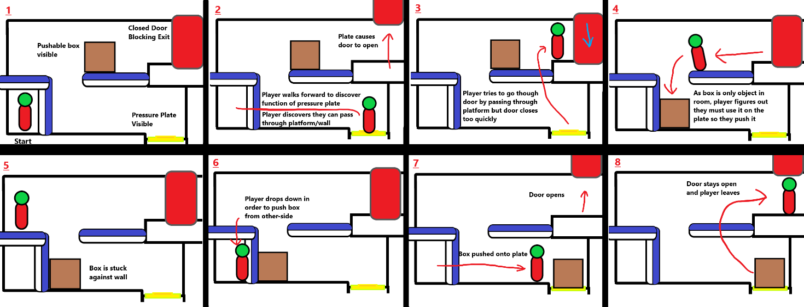
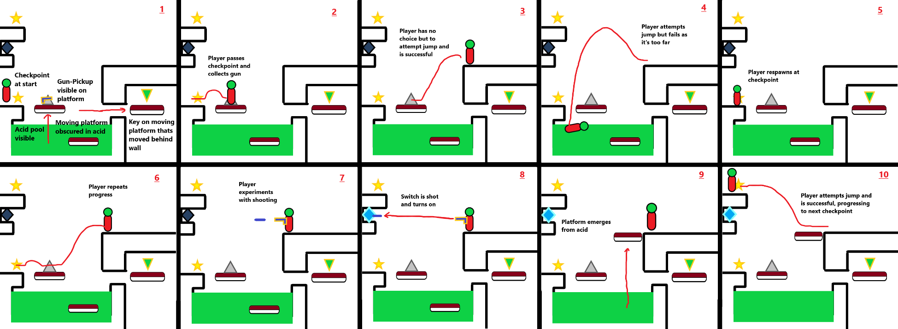
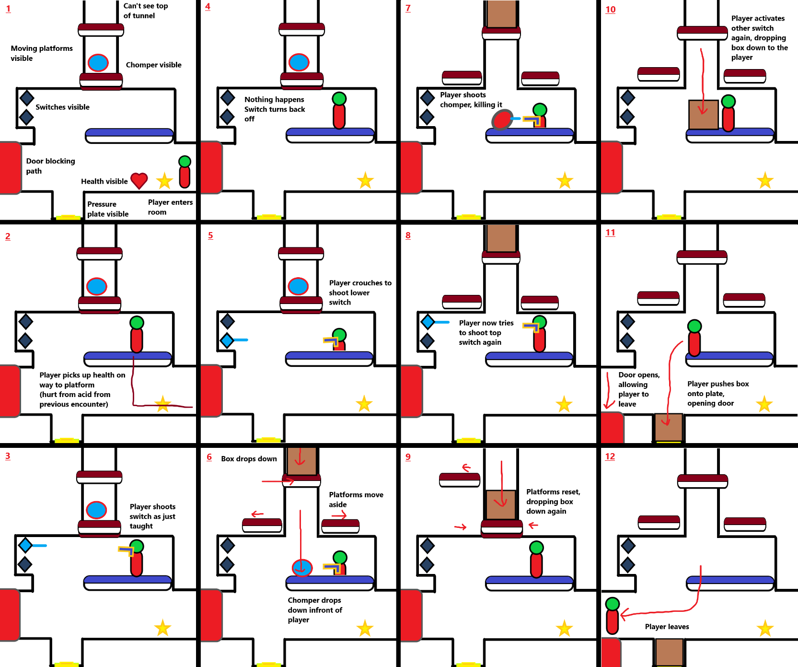
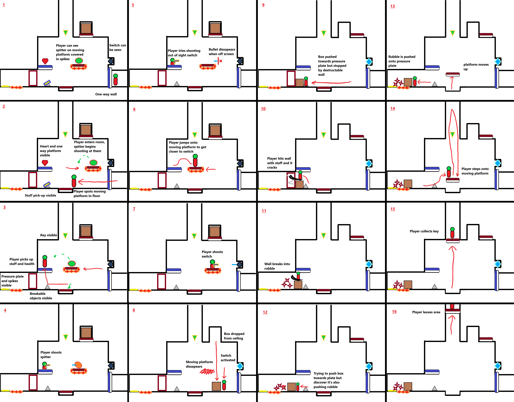
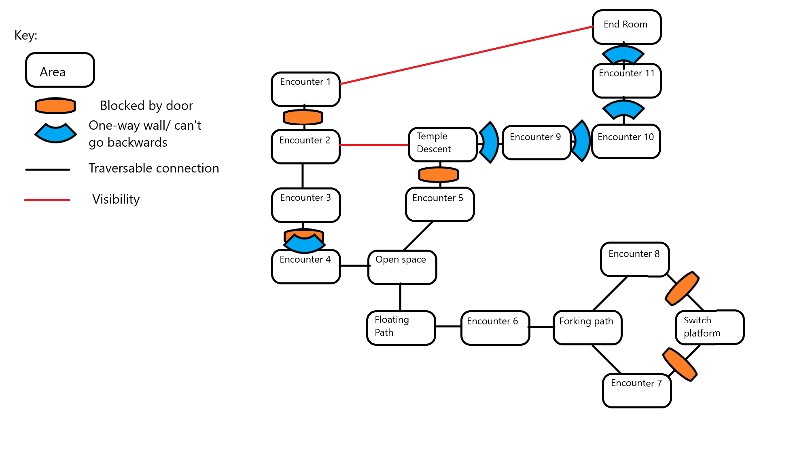
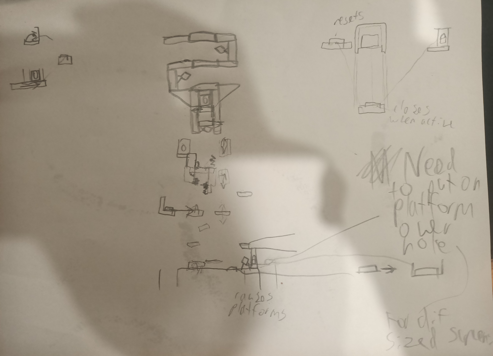
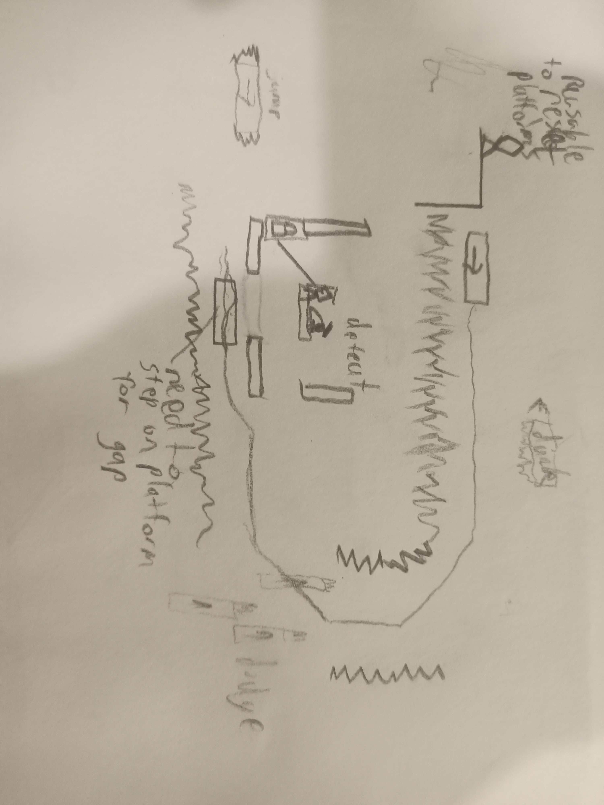

# COMP2150  - Level Design Document
### Name: Benjamin Keith
### Student number: 47311436

## 1. Player Experience (~700 words)
### 1.1. Discovery
For a player to comprehensively learn the mechanics and dynamics present within a system, they must discover the the components and their interactions in a meaningful and intuitive method. The introduction to components and initial interactions is presented primarily within the first section of my level. The first physical challenge of the level pressures the player towards discovery of the systems mechanics of player movement and ability to fire the newly acquired gun. 

When facing the second encounter, the player has witnessed a key move behind a wall, and their only clear pathway is a raised walkway across a pool of acid. Additionally the player has seen a moving platform with a skeleton raise up from the acid pool, which simultaniously serves the purpose of communicating with the player that the acid is dangerous and giving them the gun. The unobtainability of the key creates the want for exploration in the player by defining a goal to incentivise them, but in order to explore they must overcome the physical challenge of the acid pool to get to the only clear route, the raised walkway. This pressures the player into discovery as they only access to two mechanics that allow them to interact with the game, shooting and movement, which means they must use one or both of them in order to cross the acid pool. The player can jump to the walkway if they hold down space, but will miss if they only tap the key, landing in the acid pit and resaulting in failure. Failure in this instance too provides discovery as they must cross a checkpoint to enter the room, where they will appear at if they fall in acid. By forcing the player to hold space to jump the acid pit, an understanding of the capabilities of the toys movement are. By developing the understanding of movement, the player discovers complexities within the systems mechanics stemming from the ability for finer movement in spaces.
This discovery is then expanded on by presenting the player with another pathway to follow, above where they previously were. This gap is too big to be jumped by the player, and they will likely fall into the acid if they try. This now leaves the player with only shooting as a means of interaction that could solve the challenge, inevitably leading them to shooting the one-use switch across the acid pool which brings up another platform that allows them to jump across the pit. This instance presents discovery of the limits of movement but also how the mechanics of activating a switch by shooting it create a dynamic stemming from game rules.

### 1.2. Drama
To create a dramatic arc within the level I have designed, the player is subjected to challenging encounters acting as difficulty spikes, that are then followed by the reward of threat free progression and travel.

The final encounter of section 1 traps the player in a room with a spitter, where they must run to the other side of the room and onto a platform to shoot it. While the challenge is minor, it is a difficulty spike that is designed to induce panic into the player, and after the player hits a switch behind the spitter, the moving platform with spikes also dissapears, indicating the room is no longer a threat and allowing the player to feel relieved as they are safe. 

Relativelt free of drama otherwise, the climax of section 2 appears in the form of a time trial, dramatically increasing the difficulty for a very short period of time. The player must ascend through a structure, to reach a door at the top while a platform does the same, where if the platform reaches the top first the door closes. The time frame the player must reach the top is very short, and the player must overcome multiple obsticles to do so.

Section 3 begins completely different to the other sections, collecting the key at the start, as the player descends deep into the ground, falling down narrow pits, the only objective left is to reach the end door.  The dramatic arc rapidly increases from the beggining, as the player faces a long, increasingly difficult challenge, while having to stay on a moving platform as it navigates the cave. Fitting in theme with the dramatic narrative of ascent and descent present within the rest of the level, section 3 ends with an ascent to the end although as a final climax to the level, the platform the player is on becomes covered with enemies they must fight off until they reach the top, where there is a corridor leading straight to the end.

### 1.3. Challenge
The level I have designed focuses on challenging physical skills, but has frequent intellectual and perceptual skill testing aspects to challenges. Throughout the level, these challenges increase in difficulty, begining in section one, where challenges are basic as they introduce concepts, such as needing to jump over acid, pushing something from the other side of a one way wall, avoiding and shooting a spitter, and using a box to push debris accross spikes and onto a pressure plate. The difficulty curve increases in section 2 such as requiring the player to engage with perceptive and intellectual skills further. 

In this example, a pushable box sits in the walkway, and the player will discover they can put it into the spike room, but cannot then enter themselves. The ability for the box to enter the spike room alone serves to mislead the player, as the solution lies in using a moving platform to push debri onto the plate and to stand on the box in acid to shoot a switch. 

Section 3 increases challenge difficulty through the only path forward being on a moving platform, as it navigates a tunnel. This sequence is the final test and the most difficult challenge of the level, as every physical skill taught to the player is tested, asking the player to make tight jumps, in small spaces, in response to obstacles that appear quickly and move around, all while staying on the platform. Additionally, the players combat skills are tested, forcing them to encounter many enemies, and either fight them to keep up with the platform, or fight them on a platform. 

### 1.4. Exploration
Exploration is used as the driving motivation behind player progression. From the first room, the player can see the end door beneath them, and a key just behind a closed door to the room. When the door opens, the key moves behind a wall, becoming unobtainably and requiring the player to explore in order to get to it. This creates a clear goal for the player to acheive that pushes them forwards, driven by a seemingly close by goal.
Within section 2, the player is provided the most oppertunity to explore the space. As it is the most open environment, and the player is able to move around it to find where they must go. They will find they need a box to hold open a door, leading them to ascend to sky islands. Here they are provided with 2 simple choices, to go left or right, each leading to a seperate challenge. Upon completion of the challenge, the player is brought to the center, where they will see two switches, one they can use, and one on the other side the can't. This communicates to the player that there is still more to explore, which they must do so in order to access the box in the middle.

## 2. Core Gameplay (~400 words)

### 2.7. Passthrough Platforms

### 2.6. Moving Platforms 
### 2.5. Keys
### 2.2. Checkpoints
### 2.1. Acid
### 2.10. Weapon Pickup (Gun)
- fear to fascillitate discovery of movement
- large gap for moment of pause to notice gun

### 2.3. Chompers
### 2.4. Health Pickups

### 2.8. Spikes
### 2.9. Spitters
### 2.11. Weapon Pickup (Staff)

## 3. Spatiotemporal Design
### 3.1. Molecule Diagram

### 3.2. Level Map – Section 1

### 3.3.	Level Map – Section 2

### 3.4.	Level Map – Section 3

## 4. Iterative Design (~400 words)
Iterative design was pivotal in the formation of my level as it is designed currently. The intial plans for my level revolved around the appearance of traveling in a train, as the linear structure of moving right to left gave the player a clear path and goal, being to reach the front of the train. This idea was scrapped when I began planning out encounters, as i immediately realized how i would need to use more space for planned encounters. An aspect I did keep, was containing encounters within specific box areas, to make them distinct and feel like a trial for their challenge type. This is seen within the two paths to be taken in section 2, where each challenge tests seperate skills, with seperate gimmicks. 
Another major aspect kept from inital planning is the main premise of section 3, facing challenges on a moving platform. Although much smaller scale than the train, the moving platform segment incorporates alot of early plans for movement based challenges, including switches between being on the platform and on solid terrain trying to keep up.

An aspect of level that could be further improved through iterations is the final encounter of section 1. Many concepts are introduced but the major flaw is found in the use of the staff being unclear. Despite being found in front of destructable walls, the player is under-pressure from a spitter and likely isn't focused on their newly acquired tool. Iterative design would help rework the method this room introduces concepts, to make the purpose of the staff much clearer.

Hi, sorry this is incomplete. 
It's absolutely not due to lack of care or time put into it, but I messed up my time management for it.